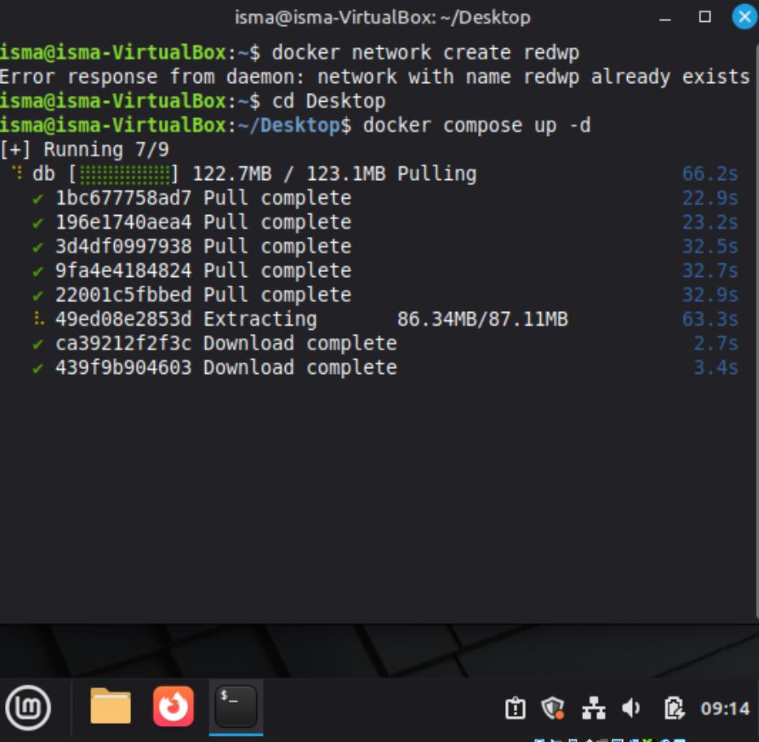
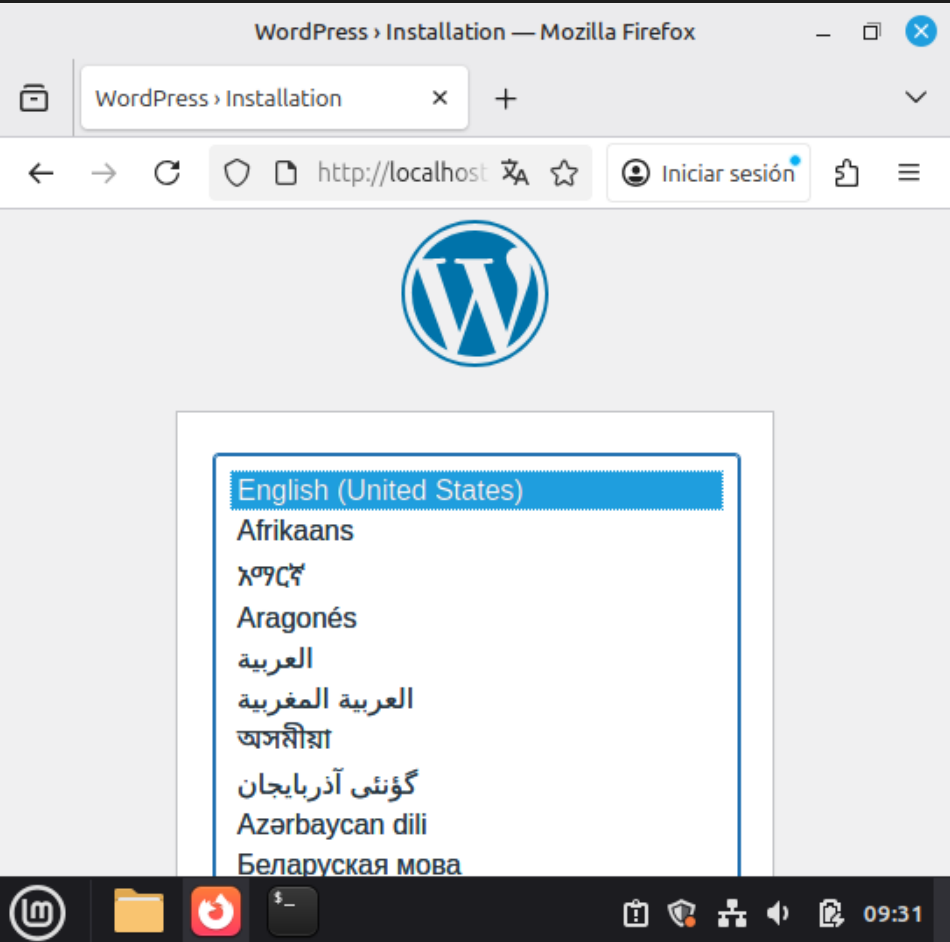
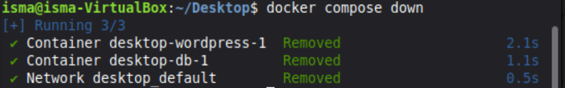
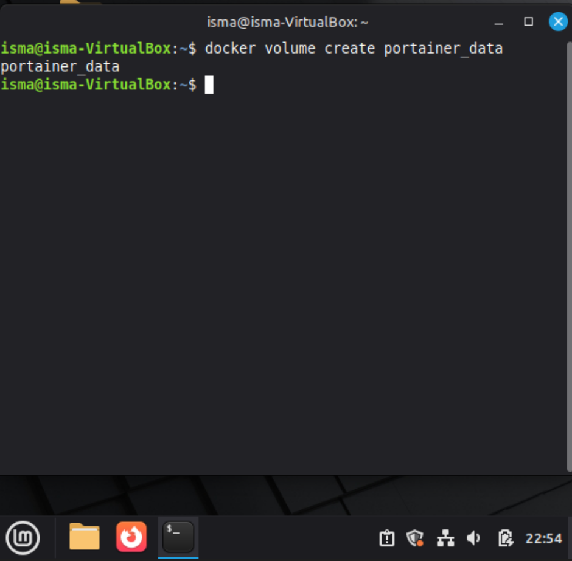

# Instalación y Requisitos

A continuación se detallan los pasos para la instalación de los dos entornos.

## Parte 1: Creación del Docker LAMP + WordPress

### 1.1 Crear el Contenedor Base
Primero creamos un contenedor basado en Ubuntu 22.04, exponiendo el puerto 80 del contenedor al 8080 del anfitrión.

```bash
docker run –it –p 8080:80 –name LAMP Ubuntu:22.04 /bin/bash
```

{: style="width: 100%; max-width: 600px;"}
{: style="width: 100%; max-width: 600px;"}

### 1.2 Instalación de Paquetes
Dentro del contenedor, actualizamos e instalamos los servicios necesarios (Apache, MariaDB, PHP, WordPress).

```bash
apt update
apt install wordpress php libapache2-mod-php mariadb-server php-mysql
```

Podemos iniciar Apache con:
```bash
service apache2 start
```

{: style="width: 100%; max-width: 600px;"}

### 1.3 Configuración de Apache
Necesitamos configurar Apache para servir WordPress. Instalamos un editor de texto:
```bash
apt install nano
```
Creamos el fichero `/etc/apache2/sites-available/wordpress.conf` y configuramos el `URL rewriting`:
```bash
a2ensite wordpress
a2enmode rewrite
service apache2 restart
```

### 1.4 Configuración de Base de Datos
Iniciamos MariaDB y aseguramos la instalación:
```bash
service mariadb start
mysql_secure_installation
```
Luego accedemos a MySQL para crear la base de datos y el usuario:
```sql
CREATE DATABASE wordpress;
CREATE USER 'wordpress'@'%' IDENTIFIED BY 'MyPass-2023';
GRANT ALL PRIVILEGES ON wordpress.* TO 'wordpress'@'%' WITH GRANT OPTION;
```

{: style="width: 100%; max-width: 600px;"}
{: style="width: 100%; max-width: 600px;"}

---

## Parte 2: Instalación de Portainer CE

### 2.1 Crear Volumen
Creamos un volumen para persistir los datos de Portainer:
```bash
docker volume create portainer_data
```

{: style="width: 100%; max-width: 600px;"}

### 2.2 Ejecutar el Contenedor
Lanzamos Portainer mapeando los puertos 8000 y 9443:

```bash
docker run -d -p 8000:8000 -p 9443:9443 --name portainer \
    --restart=always \
    -v /var/run/docker.sock:/var/run/docker.sock \
    -v portainer_data:/data \
    portainer/portainer-ce:latest
```

{: style="width: 100%; max-width: 600px;"}
