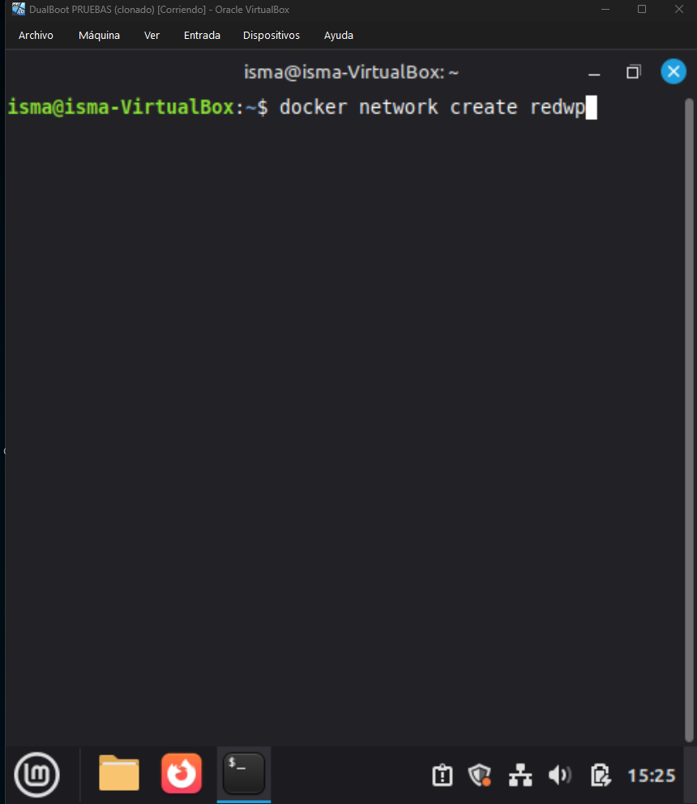
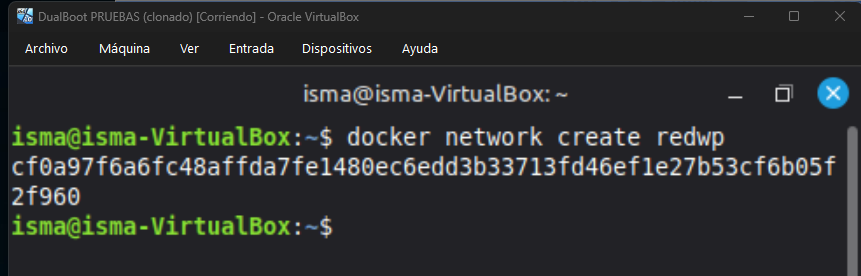
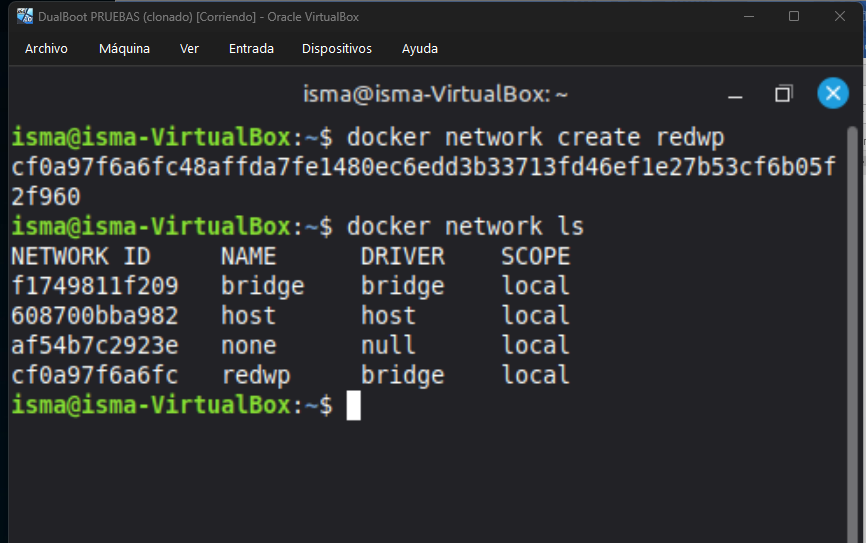
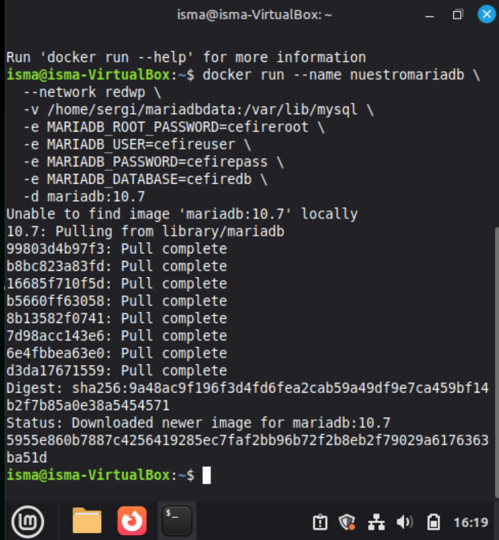
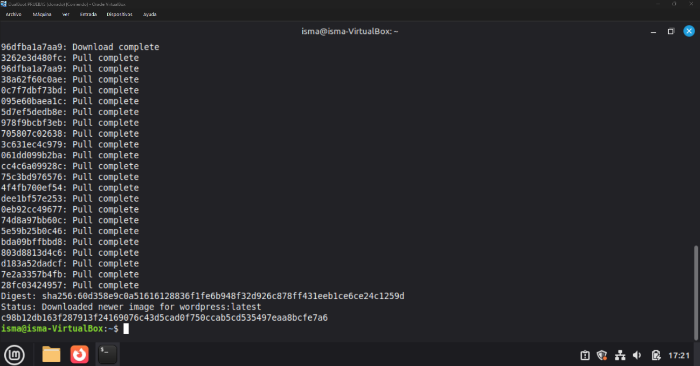
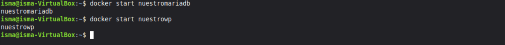
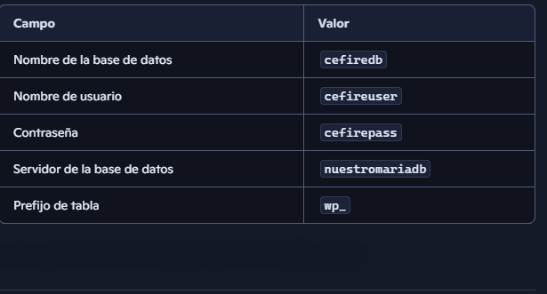
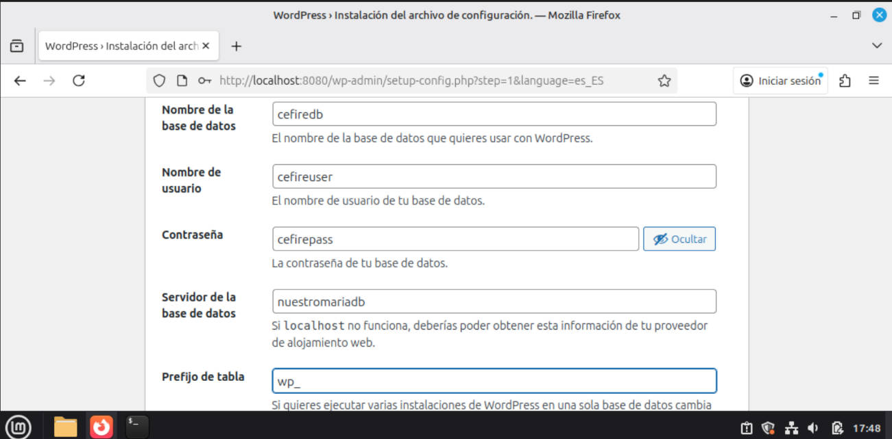
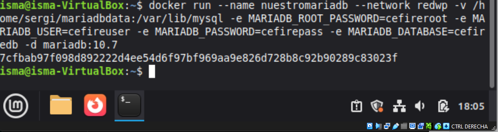
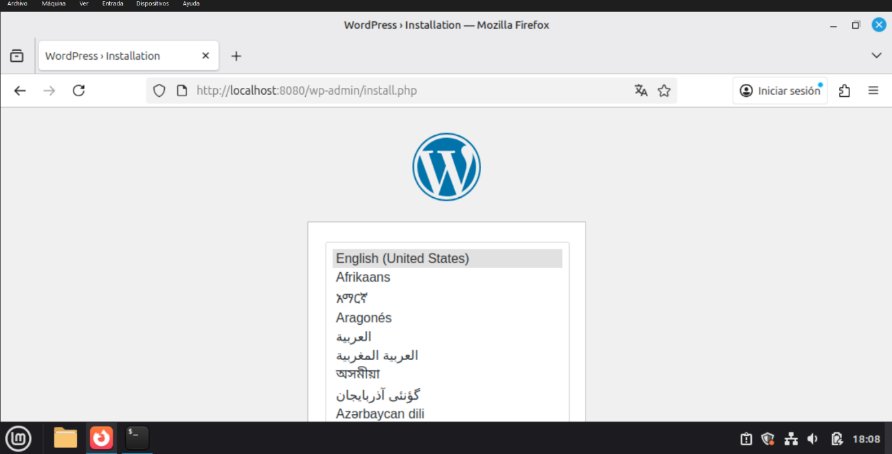

# Case Study: WordPress + MariaDB (Separate Containers)

In this practice, we will deploy a WordPress CMS connecting two separate containers through a custom Docker network:

1.  **MariaDB Container**: Database server.
2.  **WordPress Container**: Web server with Apache+PHP and pre-installed WordPress.

Additionally, we will perform a **version migration** of MariaDB while preserving data.

## 1. Network Configuration

First, we create a Docker network to allow communication between containers.

```bash
docker network create redwp
```

{: style="width: 100%; max-width: 600px;"}

To verify that it has been created correctly:
```bash
docker network ls
```

{: style="width: 100%; max-width: 600px;"}

## 2. MariaDB Deployment

We create the database container connected to the `redwp` network and use a volume for persistence.

```bash
docker run --name nuestromariadb \
  --network redwp \
  -v /home/sergi/mariadbdata:/var/lib/mysql \
  -e MARIADB_ROOT_PASSWORD=cefireroot \
  -e MARIADB_USER=cefireuser \
  -e MARIADB_PASSWORD=cefirepass \
  -e MARIADB_DATABASE=cefiredb \
  -d mariadb:10.6
```

{: style="width: 100%; max-width: 600px;"}
{: style="width: 100%; max-width: 600px;"}

Environment variables used:
*   `MARIADB_ROOT_PASSWORD`: Root user password.
*   `MARIADB_USER`: New user created.
*   `MARIADB_PASSWORD`: Password for the new user.
*   `MARIADB_DATABASE`: Initial database name.

## 3. WordPress Deployment

We launch the WordPress container, connecting it to the same network and exposing port 8080.

```bash
docker run --name nuestrowp --network redwp -p 8080:80 -d wordpress
```

{: style="width: 100%; max-width: 600px;"}
{: style="width: 100%; max-width: 600px;"}

### Initial Configuration

1.  Access `http://localhost:8080`.
2.  Select language (Spanish/English).

{: style="width: 100%; max-width: 500px;"}

3.  Configure the database connection:

{: style="width: 100%; max-width: 500px;"}

| Field | Value |
| :--- | :--- |
| **Database Name** | `cefiredb` |
| **Username** | `cefireuser` |
| **Password** | `cefirepass` |
| **Database Host** | `nuestromariadb` (Container Name) |

{: style="width: 100%; max-width: 500px;"}

4.  Finish installation by creating the WordPress admin user.

{: style="width: 100%; max-width: 600px;"}
{: style="width: 100%; max-width: 600px;"}

## 4. MariaDB Migration (Update)

The goal is to upgrade the MariaDB version from 10.6 to 10.7 without losing data.

1.  **Stop and remove** the old container:
    ```bash
    docker stop nuestromariadb
    docker rm nuestromariadb
    ```
    *Note: Data persists in `/home/sergi/mariadbdata` (on the host).*

    {: style="width: 100%; max-width: 600px;"}

2.  **Create the new container** (version 10.7) mapping the same volume:
    ```bash
    docker run --name nuestromariadb \
      --network redwp \
      -v /home/sergi/mariadbdata:/var/lib/mysql \
      -e MARIADB_ROOT_PASSWORD=cefireroot \
      -e MARIADB_USER=cefireuser \
      -e MARIADB_PASSWORD=cefirepass \
      -e MARIADB_DATABASE=cefiredb \
      -d mariadb:10.7
    ```

    {: style="width: 100%; max-width: 600px;"}

3.  **Verification**:
    Accessing `http://localhost:8080` again, the site should work correctly, indicating that the database has been preserved and migrated successfully.

    {: style="width: 100%; max-width: 600px;"}
    {: style="width: 100%; max-width: 600px;"}
    {: style="width: 100%; max-width: 600px;"}
